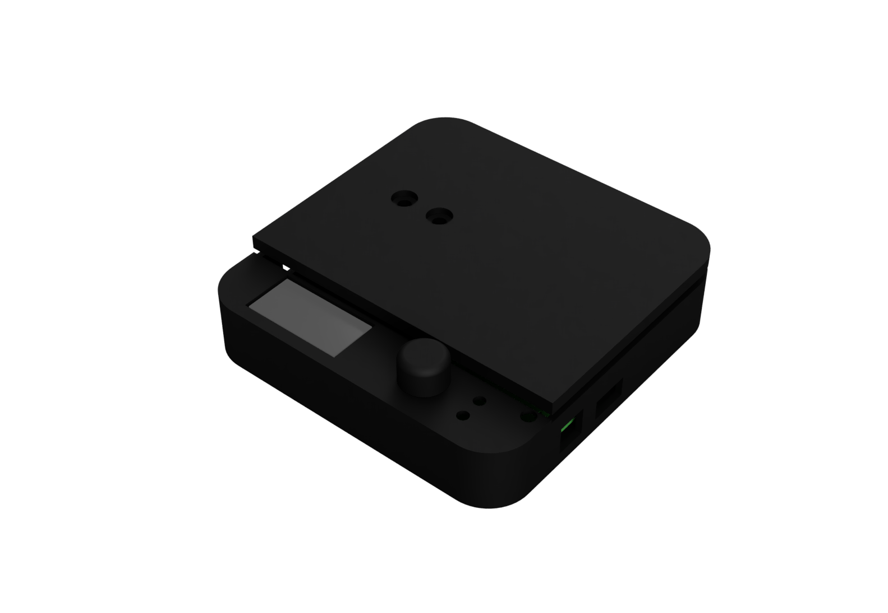

# Coffee-Scale

---

This project contains the schematics, code and 3D models for a coffee scale based on an ESP32.

 
## Features
* OTA updates via WiFi
* Recipe-based brewing
* Auto averaging of weight values: more values are used to determine weight when weight is relatively constant
* Brew timer
* USB-C charging
* Interchangeable Load Cell
* 3D-printable case
* Bluetooth and Wi-Fi connectivity

## Recipe-Based Brewing
The scale can be used to brew coffee using a step-by-step recipe. 
The recipe is stored on the scale, and can be adjusted while brewing.

Possible adjustments include:
- Changing the amount of coffee
- Changing the brew ratio
- Other adjustments based on the chosen recipe
