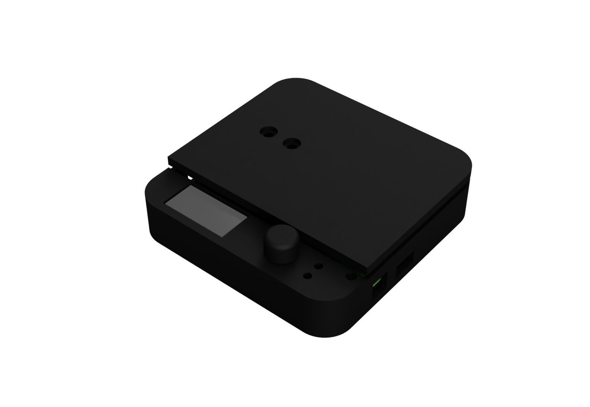

# Coffee-Scale

[](https://github.com/orlopau/coffee-scale/actions/workflows/pio_deploy.yaml)
[](https://github.com/orlopau/coffee-scale/actions/workflows/pio_test.yaml)

---

This project contains the schematics, code and 3D models for a coffee scale based on an ESP32.


 
## Features
* OTA updates via WiFi
* Recipe-based brewing
* Auto averaging of weight values: more values are used to determine weight when weight is relatively constant
* Brew timer
* USB-C charging
* Interchangeable Load Cell
* 3D-printable case
* Bluetooth and Wi-Fi connectivity

## Recipe-Based Brewing
The scale can be used to brew coffee using a step-by-step recipe. 
The recipe is stored on the scale, and can be adjusted while brewing.

Possible adjustments include:
- Changing the amount of coffee
- Changing the brew ratio
- Other adjustments based on the chosen recipe

## Development: Updating From Your Computer
During development, the scale can install a build straight from your computer over Wi-Fi, without USB and without a GitHub release.

1. In `code/`, run `pio run -t serve`. This builds the firmware and serves it on your network. It is found by the scale via mDNS, so your computer's IP does not matter. The first run installs the Python package `zeroconf`.
2. Hold the button while switching on the scale to open the updater. It connects to the Wi-Fi saved in the updater.
3. On the language screen, **long-press** the button instead of clicking. The scale searches for your computer and installs the build.

The server keeps running, so for the next build repeat steps 2 and 3 (`pio run -t serve` rebuilds when restarted). If the scale already runs the served build, it shows "No update available". Your computer and the scale must be on the same network, and the firewall must allow incoming connections for the server.

## Development: Recording the Load Cell
The scale can record the raw readings of its load cell, e.g. of taps or an espresso shot, and send them to your computer. The recordings are test data: native tests replay them with `RecordedScale` (`code/src/native/recorded_scale.h`).

1. Install a build with the recorder on the scale, see above.
2. In `code/`, run `pio run -t record`. It does not build anything, it waits for recordings. Only one of `serve` and `record` can run at a time.
3. Open the updater and long-press on the language screen, as for an update. The scale finds the recording server and starts recording.

While recording, the scale shows the weight, the recording time, the time left and the number of markers. **Click** to set a marker, e.g. when the pump starts. **Long-press** to send the recording to your computer and start the next one. A recording takes at most 5 minutes, then the scale waits for the long-press. If sending fails, the recording is kept and the next long-press tries again. A recording that wasn't sent is lost when the scale is switched off.

The computer saves each recording as `code/test/recordings/<date>_<time>.csv`. Give the useful ones a name that says what they show, commit them, and delete the rest. A recording looks like this, with `ms` counted from its start on the scale's clock:

```
# coffee-scale recording
# firmware: v1.9.0
# grams_per_count: 0.002381
ms,event,value
0,sample,84012
101,sample,84020
1234,click,
```

`grams_per_count` is the calibration of the scale that recorded, so tests can convert the raw readings to grams.

## Development: Emulator
The emulator runs the firmware on your computer, in a window that shows the scale's display. It needs SDL2 (`sudo apt install libsdl2-dev` on Debian/Ubuntu).

```
cd code
pio run -e emulator -t exec
```

With `COMPILE_LANG=de` in front, it runs in German. The load cell is simulated, and the keyboard replaces the encoder:

| Key | Action |
|---|---|
| Left / Right | turn the encoder |
| Enter, Space | press the encoder, hold for a long press |
| Up / Down | put 1 g on the scale or take it off, with Shift 0.1 g |
| PageUp / PageDown | 10 g on or off |
| Home | 100 g, e.g. for the calibration |
| 0, Backspace | clear the scale |
| F | pour on/off, 2 g/s |
| S | espresso shot: 6 s pre-infusion, then about 38 g in 33 s |
| N | noise on/off |
| - / + | slower/faster time, up to 20x (1x while the button is held) |
| P | save a screenshot to the current directory |
| Esc, Q | quit |

The window title shows the weight on the scale. The frame around the display lights up while the buzzer sounds. Settings are kept in memory only, and the boot splash screen and the updater only run on the device.

## Development: Screenshot Tests
The native tests render every screen through u8g2, set up like the scale's display, and compare it with the reference images in `code/test/native/test_screenshots/screens/`. A screen that changes fails the tests, and its new image is written to `code/test/native/test_screenshots/failed/` (on GitHub, attached to the CI run as `failed-screenshots`).

After changing a screen on purpose, accept the new images and commit them with the change:

```
cd code
UPDATE_SCREENSHOTS=1 pio test -e native -f native/test_screenshots
```

The diff of the pull request then shows each changed screen before and after.
